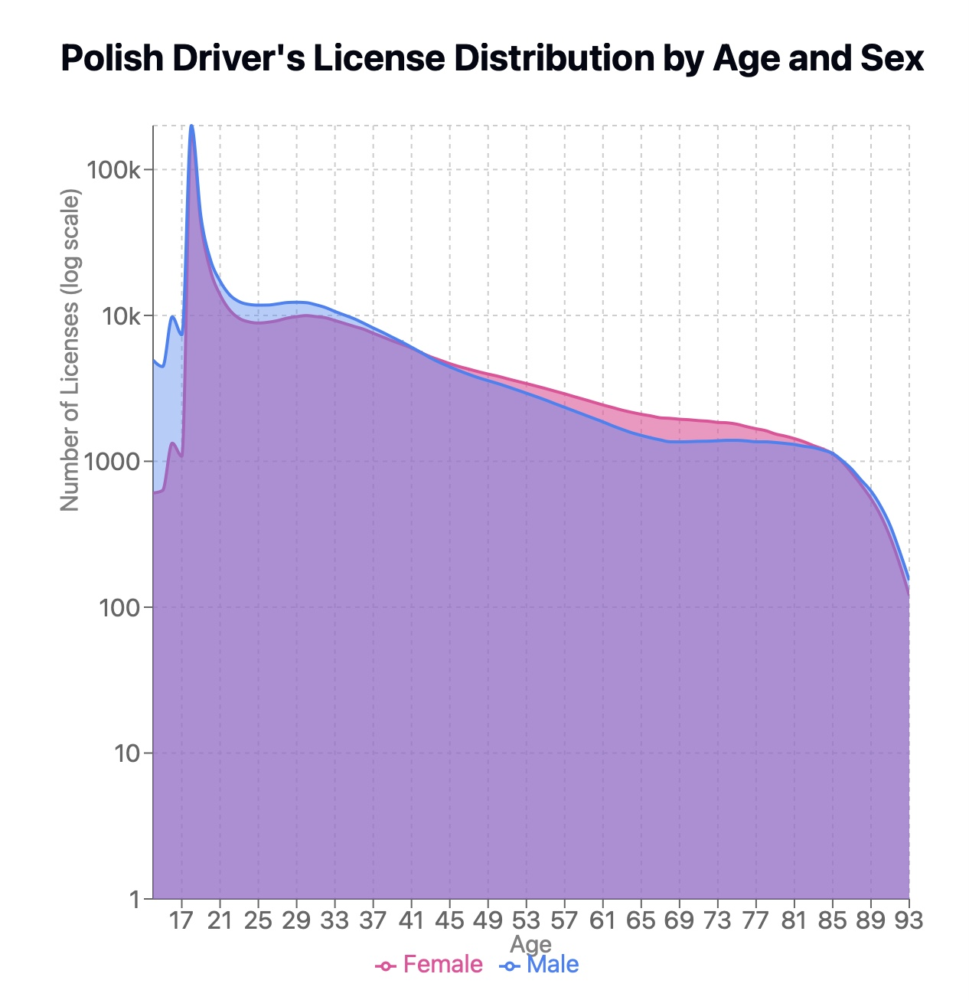

```{r setup, include=FALSE}
knitr::opts_chunk$set(echo = FALSE, warning = FALSE, message = FALSE)
library(dplyr)
library(ggplot2)
library(ggthemes)
theme_set(theme_bw())
```

```{r}
dat <- read.csv("./data/polish-driver-license.csv") 
```

Źródło danych: https://github.com/michbur/polish-driver-license

## Rysunek 1

```{r}
group_by(dat, age, voivodeship) %>% 
  summarise(mean = mean(count)) %>% 
  ggplot(aes(x = age, y = mean, fill = voivodeship)) +
  geom_col() +
  ggtitle("Przed poprawkami")
```

Cel: pokazanie średniej liczby osób, które uzyskały prawo jazdy w danym wieku w zależności od województwa.

Zmiany:

Zaproponowany wykres to wykres słupkowy z facetem na województwach.
Dla każdego województwa oś odciętych to wiek (lub zgrupowany przedział wieku, bo widzimy najwięcej zdarzeń zaraz po okresie pełnoletności ) 
Oś rzędnych to licznośc danej grupy kursantów 
Kolory nie są niezbędne. Byc może ich brak poprawi czytelnośc wykresu
Możemy wprowadzic nieciągłość (odcięcie) wykresu dla wieku ok 18 lat. 

```{r, fig.height=8}
mutate(dat, age = cut(age, breaks = c(14, 17, 21, 30, 49, max(dat$age)), include.lowest = TRUE)) %>% 
  group_by(age, voivodeship) %>% 
  summarise(mean = mean(count)) %>% 
  ggplot(aes(x = age, y = mean)) +
  geom_col() +
  facet_wrap(~ voivodeship, ncol = 3) +
  ggtitle("Po poprawkach") +
  theme(axis.text.x = element_text(angle = 90))
```

## Rysunek 2

```{r}
group_by(dat, gender, voivodeship) %>% 
  summarise(total = sum(count)) %>% 
  mutate(fraction = total/sum(total)) %>% 
  ggplot(aes(x = gender, y = fraction, fill = voivodeship)) +
  geom_col() +
  ggtitle("Przed poprawkami")
```

Cel: pokazanie frakcji kobiet i mężczyzn uzyskujących prawo jazdy w danym województwie.

Zmiany: 

oś x: frakcja kobiet i mężczyzn
oś y: województwo
kolor: płec (kobiety różowy, mężczyźni niebieski)
Jeden wykres słupkowy dla 16 województw, zamiast skumulowania, przedstawienie frakcji mężczyzn i kobiet obok siebie, odwrócenie osi (dla łatwiejszego odczytania etykiet), pozbycie się 16 kolorów, pozostawienie 2 kolorów (kobiety - mężczyźni)
2) analogicznie do powyższego wykres punktowy, w przypadku nakładania się punktów zastosowanie kształtów
3) 16 fasetów oddzielnie dla każdego województwa, wtedy pozostawienie tych samych osi x i y


```{r}
group_by(dat, gender, voivodeship) %>% 
  summarise(total = sum(count)) %>% 
  mutate(fraction = total/sum(total)) %>% 
  ggplot(aes(x = fraction, y = voivodeship, fill = gender)) +
  geom_col(position = "dodge") +
  ggtitle("Po poprawkach") 
```

## Rysunek 3

```{r}
group_by(dat, month, year, voivodeship) %>% 
  summarise(total = sum(count)) %>% 
  filter(voivodeship == "WOJ. MAZOWIECKIE") %>% 
  ggplot(aes(x = factor(year), y = total)) +
  geom_boxplot() +
  scale_x_discrete("Year") +
  scale_color_discrete("Month") +
  geom_point(aes(color = factor(month))) +
  ggtitle("Mazowieckie", "Przed poprawkami")
```

Cel: pokazanie zmienności liczby uzyskanych praw jazdy w skali roku w zależności od roku w województwie mazowieckim.

Zmiany:

Opis: wykres liniowy liczby uzyskanych praw jazdy - 4 linie odpowiadajace latom a na osi odciętych od 1 do 12 (miesiące). Wyróżnienie serii kolorami
Opis szczegółowy: 
    x = miesiąc kalendarzowy roku
    y = liczba uzyskanych praw jazdy
    seria (kolor) = rok
    tytuł: "Liczba uzyskanych praw jazdy w województwie mazowieckim".
    Poprawić legendę miesięcy - z liczb na opisy
    Poprawić przecięcie między osiami x i y

```{r}
group_by(dat, month, year, voivodeship) %>% 
  summarise(total = sum(count)) %>% 
  filter(voivodeship == "WOJ. MAZOWIECKIE") %>% 
  ggplot(aes(x = month, y = total, color = factor(year))) +
  geom_point() +
  geom_line() +
  scale_x_continuous("Month", breaks = 1L:6*2) +
  scale_color_discrete("Year") +
  ggtitle("Liczba uzyskanych praw jazdy w województwie mazowieckim", "Po poprawkach")
```


## Rysunek 4

```{r}
group_by(dat, gender, age) %>% 
  summarise(total = sum(count)) %>% 
  ggplot(aes(x = age, y = total, color = gender)) +
  geom_point() +
  ggtitle("Przed poprawkami")

```

Cel: pokazać zależność liczby uzyskanych praw jazdy w zależności od wieku i płci.

Zmiany:

Atrybuty wizualne:
- os x - grupa wiekowa, zageszczenie skali dla lepszej definicji

Geometrie:
 - zmiana wykresu na slupkowy

Statystyki:
- pozostajemy przy sumie wydanych prawo jazd / grupa wiekowa, mozliwe rowniez przejscie na procenty

Fasety:
- odizolowanie przedzialow wiekowych dla czytelniejszego przedstawienia danych grup w zaleznosci od aktywnosci
(0-30, 30-60, 60+)


```{r}
mutate(dat, age = cut(age, breaks = c(0, 30, 60, max(dat$age)), include.lowest = TRUE)) %>% 
  group_by(gender, age) %>% 
  summarise(total = sum(count)) %>% 
  ggplot(aes(x = age, y = total, fill = gender)) +
  geom_col() +
  ggtitle("Po poprawkach") 

```

Zmiana dodatkowa:

Jeśli chodzi o atrybuty wizualne na początek nie zmieniałbym osi X - niech nadal przestawia wiek.  Kolorem będzie przedstawiona płeć a na osi Y nadal niech będzie przestawiona liczba zdanych egzaminów ALE z racji tego iż jest duży rozstrzał pomiędzy wartościami zmieniłbym skale na logarytmiczną (oczywiście informując o tym wyraźnie czytelnika wykresu). Kropki płci nakładają się na siebie i z tego powodu czytelnik może nie być pewny czy pod spodem kropki jest "coś" jeszcze. 
Rozwiązaniem wyżej wymienionych problemów może być tzw. area chart, gdzie przezroczystość pozwala na dostrzeżenie warstw (odpowiedzialnych za podział ze względu na płeć) [załącznik propozycja 1.jpg]

```{r}

```


## Rysunek 5

```{r,fig.height=7}
group_by(dat, month, age) %>% 
  summarise(total = sum(count)) %>% 
  ggplot(aes(x = month, y = total)) +
  geom_point() + 
  facet_wrap(~ age) +
  theme(axis.text.x = element_text(angle = 90)) +
  ggtitle("Przed poprawkami")
```

Cel: pokazać liczbę praw jazdy uzyskiwanych przez osoby w różnym wieku w zależności od miesiąca.

Zmiany: 

Fasety miesięczne, na osi X wiek (wartości całkowite), na osi Y ilość praw jazdy (wartości całkowite), skok o 5k . Wykres słupkowy. Na osi X tworzymy kubełki zawierające wyniki dla konkretnych przedziałów wieku 14-17, 18-19, 20-30, 31-90. 

```{r,fig.height=7}
mutate(dat, age = cut(age, breaks = c(14, 17, 19, 20, 30, max(dat$age)), include.lowest = TRUE)) %>% 
  group_by(month, age) %>% 
  summarise(total = sum(count)) %>% 
  ggplot(aes(x = age, y = total)) +
  geom_col() + 
  facet_wrap(~ month) +
  theme(axis.text.x = element_text(angle = 90)) +
  ggtitle("Po poprawkach")
```


## Rysunek 6

```{r,fig.height=7}
group_by(dat, year, gender, voivodeship) %>% 
  summarise(total = sum(count)) %>% 
  ggplot(aes(x = year, y = gender, fill = total)) +
  geom_tile(color = "black") +
  facet_wrap(~ voivodeship) +
  ggtitle("Przed poprawkami")
```

Cel: pokazać liczbę uzyskanych praw jazdy dla poszczególnych województw w zależności od płci i roku.

Zmiany:

pomysł 1. użycie mapy Polski, dla każdego województwa 4x2 kolumny po latach i podzielone na kobiety/mężczyzn (różne kolory)

```{r,fig.height=7}
group_by(dat, year, gender, voivodeship) %>% 
  summarise(total = sum(count)) %>% 
  ggplot(aes(x = year, y = total, fill = gender)) +
  geom_col(color = "black", position = "dodge") +
  facet_wrap(~ voivodeship, ncol = 3) +
  ggtitle("Po poprawkach")
```
